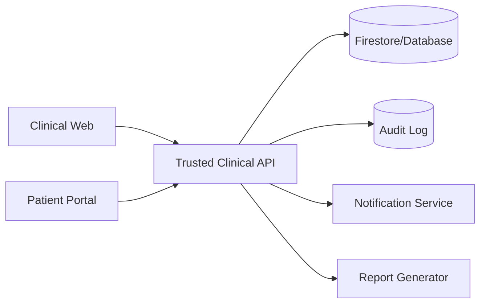

# Model Data, Backend Tepercaya, dan API

## 1. Arsitektur target



Frontend hanya mengirim input mentah. Backend:

- memeriksa role dan unit;
- membaca pasien terbaru;
- menghitung IDWG;
- menentukan zona;
- menyimpan dry weight snapshot;
- membuat alert;
- memperbarui summary;
- menulis audit;
- menjamin idempotency.

## 2. Struktur organisasi

```
organizations/{orgId}
organizations/{orgId}/units/{unitId}
organizations/{orgId}/members/{uid}
organizations/{orgId}/patients/{patientId}
organizations/{orgId}/patients/{patientId}/sessions/{sessionId}
organizations/{orgId}/patients/{patientId}/dry_weight_history/{id}
organizations/{orgId}/alerts/{alertId}
organizations/{orgId}/audit_logs/{eventId}
organizations/{orgId}/import_jobs/{jobId}
organizations/{orgId}/report_documents/{documentId}
organizations/{orgId}/portal_tokens/{tokenId}
```

## 3. Patient

```json
{
  "patient_id": "uuid",
  "organization_id": "...",
  "unit_id": "...",
  "rm": "00012345",
  "name": "...",
  "birth_date": "1975-08-21",
  "sex": "P",
  "status": "ACTIVE",
  "current_dry_weight_kg": 52.5,
  "current_dry_weight_version": 7,
  "latest_summary": {
    "session_id": "...",
    "session_at": "...",
    "idwg_pct": 3.8,
    "zone": "KUNING",
    "yellow_streak": 2
  },
  "created_at": "server time",
  "updated_at": "server time",
  "version": 12
}
```

## 4. Dry weight history

```json
{
  "history_id": "uuid",
  "patient_id": "...",
  "old_weight_kg": 53.0,
  "new_weight_kg": 52.5,
  "effective_at": "...",
  "reason_code": "CLINICAL_REASSESSMENT",
  "reason_text": "...",
  "proposed_by": "uid",
  "approved_by": "uid",
  "approved_at": "...",
  "status": "APPROVED"
}
```

## 5. Session

```json
{
  "session_id": "uuid",
  "submission_id": "client-generated-uuid",
  "patient_id": "...",
  "unit_id": "...",
  "session_at": "server time",
  "shift_code": "PAGI",
  "pre_weight_kg": 54.5,
  "post_weight_kg": 52.8,
  "dry_weight_used_kg": 52.5,
  "dry_weight_version": 7,
  "idwg_raw_pct": 3.8095238,
  "idwg_display_pct": 3.8,
  "zone": "KUNING",
  "formula_version": "IDWG_V1",
  "threshold_version": "ZONE_2026_V1",
  "protocol_version": "HD_FLUID_V1",
  "status": "VERIFIED",
  "recorded_by": "uid",
  "verified_by": "uid",
  "created_at": "server time"
}
```

## 6. Correction record

```json
{
  "correction_id": "uuid",
  "session_id": "...",
  "requested_by": "uid",
  "requested_at": "...",
  "reason": "Salah input berat pasca-HD",
  "changes": [
    {"field": "post_weight_kg", "from": 55.2, "to": 52.8}
  ],
  "status": "APPROVED",
  "reviewed_by": "uid",
  "reviewed_at": "...",
  "derived_session_version": 2
}
```

## 7. Alert

```json
{
  "alert_id": "uuid",
  "patient_id": "...",
  "trigger_session_id": "...",
  "type": "RECENT_RED",
  "severity": "HIGH",
  "status": "OPEN",
  "triggered_at": "...",
  "assigned_to": null,
  "sla_due_at": "...",
  "protocol_version": "HD_FLUID_V1",
  "timeline": []
}
```

## 8. Report document

```json
{
  "document_id": "uuid",
  "patient_id": "...",
  "period": "2026-07",
  "status": "PUBLISHED",
  "generated_at": "...",
  "generated_by": "system",
  "data_snapshot_version": "...",
  "template_version": "PATIENT_REPORT_V2",
  "file_object_key": "...",
  "verification_code": "ZH-RPT-7K29P"
}
```

## 9. API inti

### Session

- `POST /clinical/sessions/preview`
- `POST /clinical/sessions`
- `GET /clinical/patients/{id}/sessions`
- `POST /clinical/sessions/{id}/correction-requests`
- `POST /clinical/corrections/{id}/approve`

### Patient

- `GET /clinical/patients`
- `POST /clinical/patients`
- `PATCH /clinical/patients/{id}`
- `POST /clinical/patients/{id}/dry-weight-proposals`
- `POST /clinical/dry-weight-proposals/{id}/approve`

### Alert

- `GET /clinical/alerts`
- `POST /clinical/alerts/{id}/accept`
- `POST /clinical/alerts/{id}/escalate`
- `POST /clinical/alerts/{id}/resolve`

### Portal

- `POST /portal/qr/resolve`
- `POST /portal/auth/verify-pin`
- `POST /portal/auth/verify-otp`
- `GET /portal/me/report-summary`
- `GET /portal/me/reports`
- `GET /portal/me/schedule`
- `POST /portal/me/delegations`

### Import

- `POST /admin/import-jobs`
- `POST /admin/import-jobs/{id}/validate`
- `POST /admin/import-jobs/{id}/execute`
- `GET /admin/import-jobs/{id}`
- `GET /admin/import-jobs/{id}/result`

## 10. Idempotency

Setiap write penting menerima header atau field:

```
Idempotency-Key: <uuid>
```

Backend menyimpan hasil request. Request ulang mengembalikan hasil yang sama.

## 11. Concurrency

Gunakan optimistic concurrency/version:

- patient `version`;
- dry weight version;
- alert status version;
- correction version.

Jika data berubah setelah form dibuka, backend mengembalikan conflict dan frontend meminta pengguna mereview.

## 12. Query dan pagination

- cursor-based pagination;
- filter unit;
- filter periode;
- limit default;
- hindari subscription seluruh session;
- detail pasien memuat 20 sesi terakhir, lalu load more;
- dashboard memakai aggregate/materialized summary.

## 13. Audit service

Audit ditulis oleh backend, bukan client. Event memiliki:

- actor;
- role;
- org/unit;
- action;
- resource;
- before/after yang disanitasi;
- request ID;
- timestamp;
- outcome;
- reason.

## 14. Data retention

Tetapkan per kategori:

- session klinis;
- audit;
- token QR;
- import file;
- report PDF;
- notification log;
- device/session log.

Retensi harus sesuai kebijakan fasilitas dan regulasi yang berlaku.

## 15. Firestore/security rules principle

- client tidak menulis computed fields;
- client tidak menulis summary;
- client tidak membuat alert;
- client hanya membaca data unit yang ditugaskan;
- portal hanya membaca view pasien melalui API;
- service account backend memiliki write terkontrol;
- emulator tests wajib.
