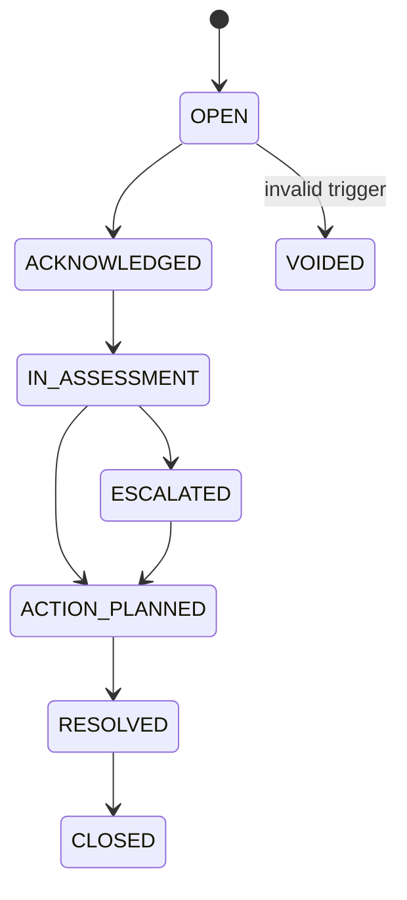

# Alert dan Workflow Klinis

## 1. Tujuan

Alert harus mendorong tindakan, bukan sekadar menambah badge. Setiap alert wajib memiliki pemicu, penanggung jawab, SLA, tindakan, hasil, dan penutupan.

## 2. Jenis alert awal

- zona merah terbaru;
- tiga sesi kuning berturut-turut;
- tren memburuk;
- perubahan berat ekstrem;
- sesi ganda potensial;
- data sesi tidak lengkap;
- pasien terjadwal tidak hadir;
- berat kering berubah tanpa review;
- komplikasi berulang bila modul tersedia.

Jenis baru hanya ditambahkan setelah disahkan dan diuji untuk mencegah alert fatigue.

## 3. Status alert

## 4. Makna status

- `OPEN`: baru dibuat, belum diterima.
- `ACKNOWLEDGED`: petugas menyatakan telah melihat.
- `IN_ASSESSMENT`: sedang dinilai.
- `ESCALATED`: diteruskan ke role lebih tinggi.
- `ACTION_PLANNED`: rencana tindak lanjut tercatat.
- `RESOLVED`: kondisi/tugas dinilai selesai.
- `CLOSED`: penutupan administratif dan audit final.
- `VOIDED`: alert invalid dengan alasan.

Jangan memakai satu tombol “ditindaklanjuti” untuk semua status.

## 5. Timeline alert

Setiap event:

- timestamp server;
- actor;
- role;
- status lama dan baru;
- catatan;
- action code;
- assignment;
- due date;
- attachment reference jika diizinkan.

## 6. Assignment

- auto-assign berdasarkan shift/unit;
- manual reassign;
- ownership jelas;
- fallback supervisor;
- notifikasi bila tidak diterima dalam SLA;
- handover jika shift berganti.

## 7. SLA

SLA ditetapkan tim klinis. Sistem mendukung:

- waktu acknowledge;
- waktu assessment;
- waktu escalation;
- waktu resolve;
- indikator terlambat;
- alasan keterlambatan.

## 8. Deduplication

Backend mencegah alert berulang untuk kondisi yang sama:

- dedupe key: patient + type + episode;
- alert aktif tidak dibuat ulang tanpa episode baru;
- definisi episode ditetapkan;
- sesi koreksi dapat memperbarui atau membatalkan alert.

## 9. Alert merah

Alur contoh:

1. session final dihitung merah;
2. backend membuat alert;
3. dashboard menampilkan prioritas tinggi;
4. petugas menerima;
5. asesmen dicatat;
6. eskalasi dokter bila diwajibkan;
7. tindakan dicatat;
8. follow-up dijadwalkan;
9. alert diselesaikan dengan outcome.

## 10. Yellow streak

- dihitung dari urutan sesi valid;
- tidak hanya mengandalkan summary sebelumnya;
- sesi duplikat/koreksi tidak menggandakan streak;
- episode baru didefinisikan setelah zona non-kuning atau periode tertentu;
- alert dapat dibuka kembali sesuai kebijakan.

## 11. Action catalogue

Contoh action code:

- `EDUCATION_REINFORCED`;
- `DIETITIAN_REFERRAL`;
- `DRY_WEIGHT_REVIEW_REQUESTED`;
- `DOCTOR_REVIEW_REQUESTED`;
- `FOLLOW_UP_NEXT_SESSION`;
- `CONTACT_PATIENT`;
- `NO_ACTION_REQUIRED_WITH_REASON`.

Teks bebas tetap tersedia, tetapi kode terstruktur diperlukan untuk laporan.

## 12. Koreksi sesi dan alert

Jika sesi dikoreksi:

- backend menghitung ulang;
- summary diperbarui;
- streak dihitung ulang;
- alert terkait ditandai `RECALCULATED`;
- alert invalid dapat `VOIDED` dengan referensi correction;
- audit menjaga rekam lama.

## 13. Handover

Alert aktif muncul dalam handover:

- status;
- pemilik;
- tindakan terakhir;
- langkah berikutnya;
- deadline;
- catatan risiko.

Penerima shift melakukan acknowledgement handover.

## 14. Notifikasi

Kanal:

- in-app;
- email internal;
- push;
- pesan resmi sesuai kebijakan.

Data sensitif tidak ditampilkan pada notifikasi eksternal. Notifikasi berisi tautan ke aplikasi setelah autentikasi.

## 15. Dashboard alert

Filter:

- severity;
- status;
- unit;
- shift;
- assigned to me;
- overdue;
- type;
- date range.

Urutan default:

1. overdue high severity;
2. open high severity;
3. acknowledged high severity;
4. medium severity;
5. lainnya.

## 16. Acceptance criteria

- setiap alert memiliki trigger session;
- computed alert tidak dapat dibuat client;
- transisi status tervalidasi;
- actor dan timestamp server tercatat;
- tidak ada duplikasi episode;
- koreksi memicu recalculation;
- SLA terlihat;
- alert tidak dapat ditutup tanpa outcome dan catatan minimum;
- laporan waktu respons tersedia;
- handover mencakup alert aktif.
